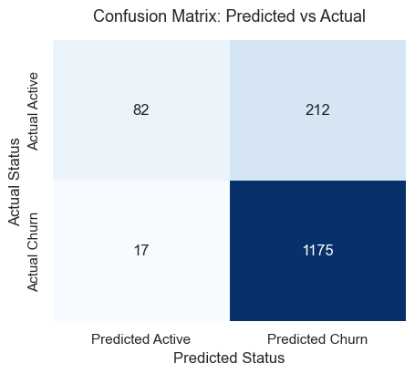
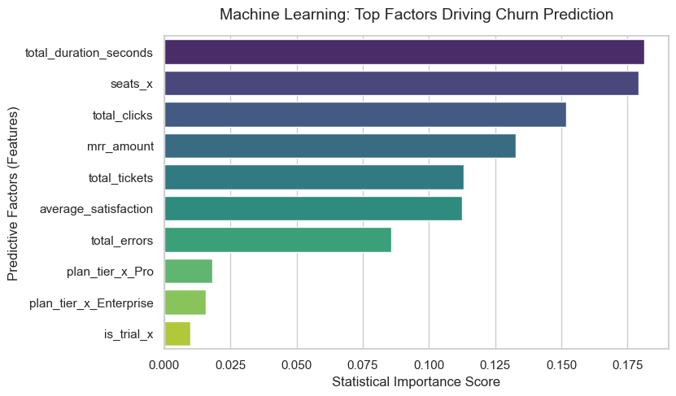

# 🌲 SaaS UX Footprints & Churn Prediction

An end-to-end Machine Learning project designed to predict subscription churn for a B2B SaaS platform (RavenStack ecosystem). By combining customer satisfaction metrics (psychometrics) with granular feature application logs (digital footprints), this project builds a highly reliable predictive baseline using a Random Forest architecture.

## 📊 Business Scenario
RavenStack operates on a seat-based subscription model. In this ecosystem, preventing customer churn is the highest priority. While traditional analysis focuses strictly on financial metrics, this project digs into user interaction data to map how friction in user experience (UX) drives corporate cancellations.

## 🚀 Key Achievements
* **Engineered Data Pipelines**: Consolidated multiple relational tables mapping customer metadata, daily features telemetry, and customer support logs.
* **Handled Recurrent Churn**: Successfully identified and addressed historical recurring customer loops (the "gym membership cancellation" pattern) to stabilize the machine learning matrix.
* **Achieved 85% Accuracy**: Trained a 100-tree Random Forest model capable of capturing **99% of all churning accounts** (0.99 recall for the churn class).

## 💡 Core Insights Discovered
Contrary to initial assumptions, technical errors or financial metrics were not the primary drivers of customer loss:
1. **The UX Frustration Trap**: `total_duration_seconds` (screen time) was crowned by the AI as the top predictor. Rather than engagement, high duration coupled with low click counts indicated operational inefficiency and user frustration—users were trapped trying to complete basic tasks.
2. **Feature Gaps & Support Friction**: Exploration confirmed that missing functional resources and support response loops represented the highest human reasons for turning away from the platform.

## 🛠️ Tech Stack & Methodology
* **Language**: Python
* **Data Manipulation**: [Pandas](https://pydata.org), OS
* **Visualizations**: [Seaborn](https://pydata.org), [Matplotlib](https://matplotlib.org)
* **Machine Learning**: [Scikit-Learn](https://scikit-learn.org) (`train_test_split`, `RandomForestClassifier`, `StandardScaler`)
* **Feature Engineering**: One-Hot Encoding (`pd.get_dummies`) with mathematical collinearity protection (`drop_first=True`).

## 📊 Model Evaluation & Metrics

The model favors high sensitivity (*recall*) for the churning class, acting as an excellent early-warning system for customer success teams to deploy active retention campaigns.

### Performance Report
```text
              precision    recall  f1-score   support

           0       0.83      0.28      0.42       294
           1       0.85      0.99      0.91      1192

    accuracy                           0.85      1486
```

### Visual Artifacts

<p align="center">
  
  
</p>

## 📂 Project Structure
```text
├── data/
│   ├── ravenstack_accounts.csv
│   ├── ravenstack_feature_usage.csv
│   ├── ravenstack_support_tickets.csv
│   └── processed_churn_data.csv       # Cleaned master dataset
├── notebooks/
│   └── churn_prediction_analysis.ipynb # Step-by-step Jupyter Notebook
├── confusion_matrix.png                # Saved heatmap graphic
├── feature_importance.png              # Saved ranking graphic
└── README.md
```

## ⚙️ How to Run
1. Clone this repository.
2. Place the RavenStack CSV files inside the `data/` directory.
3. Open and run the Jupyter Notebook sequentially.
