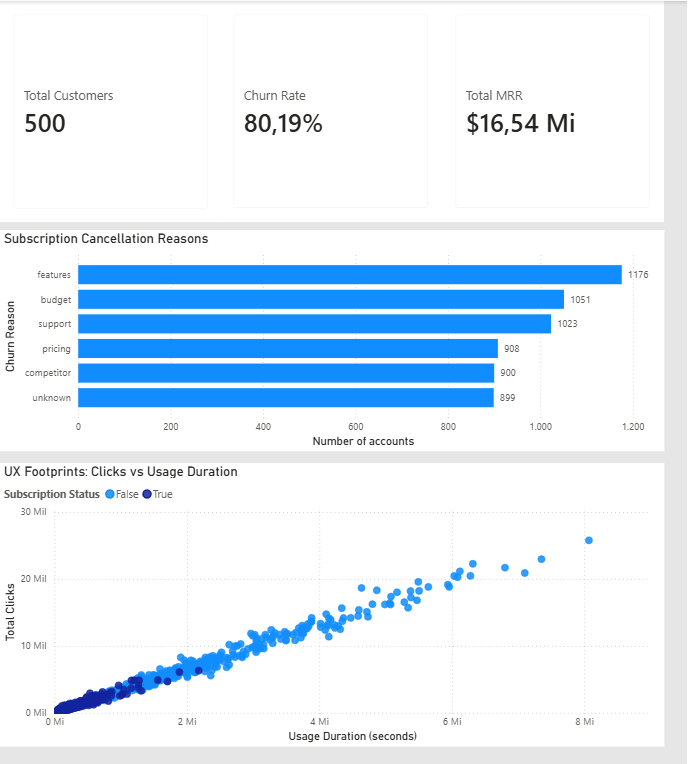

# 🌲 SaaS UX Footprints & Churn Prediction

An end-to-end Machine Learning and Business Intelligence project designed to predict and analyze subscription churn for a B2B SaaS platform (RavenStack ecosystem). By combining customer satisfaction metrics (psychometrics) with granular feature application logs (digital footprints), this project builds a predictive pipeline using Random Forest and an executive dashboard for strategic decision-making.

## 📊 Executive Dashboard View
Below is the interactive reporting layer built to present metrics directly to directors and stakeholders, capturing client counts, revenue under threat, and behavioral usage distribution.

<p align="center">
  
</p>

## 📊 Business Scenario
RavenStack operates on a seat-based subscription model with a historical **80.19% churn rate** across its customer history. In this ecosystem, preventing customer cancellation is the highest priority. While traditional analysis focuses strictly on financial indicators, this project digs into user interaction data to map how friction in user experience (UX) drives corporate cancellations.

## 🚀 Key Achievements
* **Engineered Data Pipelines**: Consolidated multiple relational tables mapping customer metadata, daily features telemetry, and customer support logs into a processed master dataset.
* **Handled Recurrent Churn**: Successfully identified and addressed historical recurring customer loops (the "gym membership cancellation" pattern) within the data matrix.
* **Achieved 85% Accuracy**: Trained a 100-tree Random Forest model capable of capturing **99% of all churning accounts** (0.99 recall for the churn class).

## 💡 Core Insights Discovered
Contrary to initial assumptions, technical errors or financial metrics were not the primary drivers of customer loss:
1. **The UX Frustration Trap**: `total_duration_seconds` (screen time) was crowned by the AI as the top predictor. Rather than healthy engagement, high duration coupled with low click counts indicated operational inefficiency and user frustration—users were trapped trying to complete basic tasks.
2. **Feature Gaps & Support Friction**: Exploration confirmed that missing functional resources (`features`) and support response loops represented the highest human reasons for turning away from the platform.

## 🛠️ Tech Stack & Methodology
* **Data & Machine Learning**: Python, Pandas, Scikit-Learn (`RandomForestClassifier`), Seaborn, Matplotlib.
* **Business Intelligence**: Power BI Desktop (June 2026 Engine) leveraging custom canvas formatting and category-agnostic tracking overlays.

## 📊 Model Evaluation & Metrics
```text
              precision    recall  f1-score   support

           0       0.83      0.28      0.42       294
           1       0.85      0.99      0.91      1192

    accuracy                           0.85      1486
```

### Visual Artifacts
<p align="center">
  
  
</p>

## 📂 Project Structure
```text
├── data/
│   └── processed_churn_data.csv       # Cleaned master dataset
├── dashboards/
│   └── churn_executive_report.pbix    # Power BI dashboard workbook
├── notebooks/
│   └── churn_prediction_analysis.ipynb # Step-by-step Jupyter Notebook
├── confusion_matrix.png                # Saved heatmap graphic
├── feature_importance.png              # Saved ranking graphic
├── dashboard_preview.png               # Dashboard screenshot
└── README.md
```
